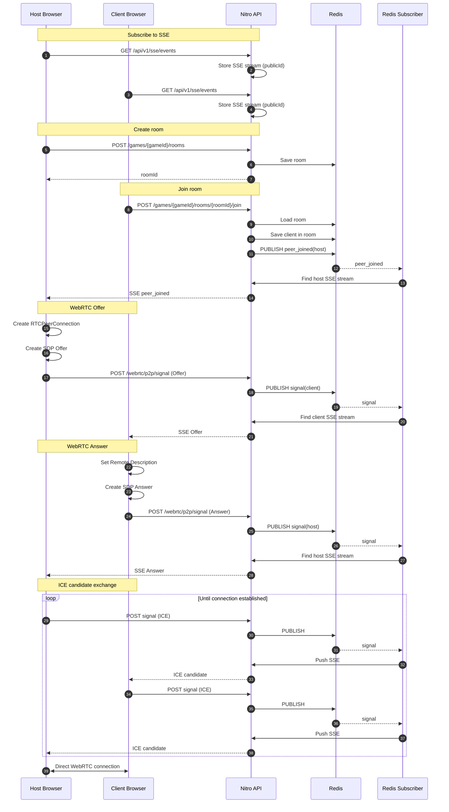

# WebRTC P2P Signaling Flow

This document describes how two peers establish a WebRTC P2P connection using Redis Pub/Sub and Server-Sent Events (SSE).

The server is used only for signaling. After signaling is complete, media/data are exchanged directly between peers over WebRTC.

## Components

- **Host** — creates a room and waits for another player.
- **Client** — joins an existing room.
- **API** — HTTP endpoints.
- **Redis** — temporary room storage and Pub/Sub transport.
- **SSE** — delivers signaling events to connected browsers.

---

## Connection sequence



---

## Step-by-step

### 1. Subscribe to SSE

Both peers establish a persistent SSE connection.

```
GET /api/v1/sse/events
```

The server stores the SSE stream associated with the visitor's `publicId`.

---

### 2. Host creates a room

```
POST /api/v1/games/{gameId}/rooms
```

The server:

- generates a random `roomId`;
- stores the room in Redis;
- associates the host with the room;
- returns the generated `roomId`.

---

### 3. Client joins the room

```
POST /api/v1/games/{gameId}/rooms/{roomId}/join
```

The server:

- verifies that the room exists;
- verifies that the room is not full;
- stores the client in the room;
- publishes a `peer_joined` event through Redis Pub/Sub.

---

### 4. Host receives `peer_joined`

The Redis subscriber receives the published message.

It looks up the host's SSE connection and pushes:

```json
{
  "type": "peer_joined",
  "gameId": "...",
  "roomId": "..."
}
```

The browser now knows that another player is waiting.

---

### 5. Host creates SDP Offer

The host creates:

- `RTCPeerConnection`
- SDP Offer

The offer is sent to the server.

```
POST /api/v1/webrtc/p2p/signal
```

The server publishes the signal through Redis.

The Redis subscriber forwards it to the client's SSE connection.

---

### 6. Client creates SDP Answer

The client:

- receives the Offer through SSE;
- creates its own `RTCPeerConnection`;
- sets the remote description;
- creates an SDP Answer;
- sends the Answer back using the same signaling endpoint.

The server forwards it to the host using Redis Pub/Sub and SSE.

---

### 7. ICE candidate exchange

Both peers discover ICE candidates.

Every candidate is sent through:

```
POST /api/v1/webrtc/p2p/signal
```

The server does not inspect the payload.

It simply republishes the message through Redis, and the subscriber forwards it over SSE.

---

### 8. Direct WebRTC connection

Once both peers have exchanged:

- SDP Offer
- SDP Answer
- ICE candidates

the WebRTC connection is established.

From this point onward:

- game traffic no longer passes through the server;
- Redis Pub/Sub is no longer involved;
- SSE is only kept alive and can still be reused for future signaling events if needed.